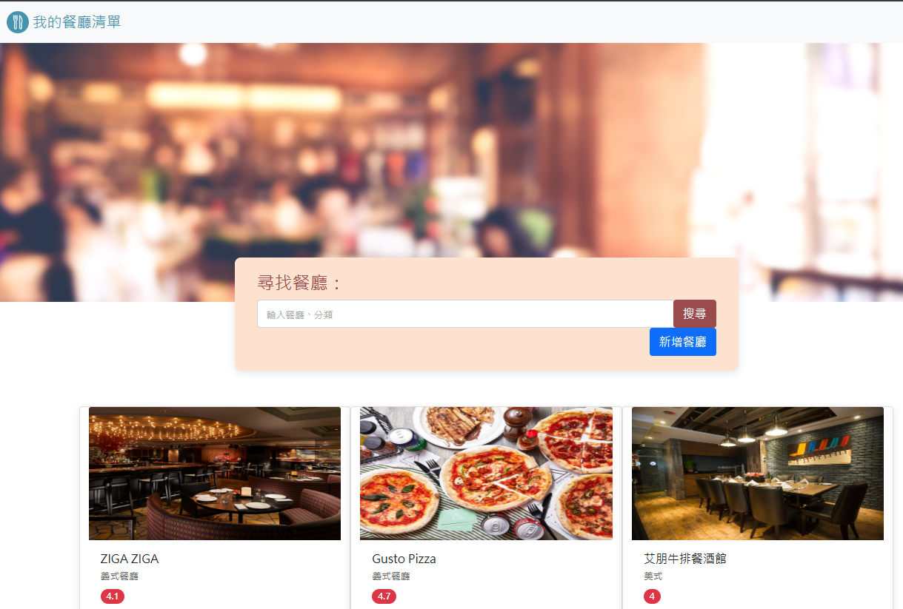

# Restaurant List ( AC 2-3 A7 )



## About - 介紹
這是用 Node.js + Express + MongoDB + Mongoose 來架構的一個餐廳網站。

## Features - 功能

* 查看所有餐廳
* 瀏覽餐廳的詳細資訊
* 連結餐廳的地址到 Google 地圖
* 搜尋特定餐廳
* 新增餐廳
* 編輯餐廳
* 刪除餐廳

## Prerequisites - 環境建置與需求

* Node.js
* Express @4.16.4
* Express-handlebars @3.0.0
* MongoDB
* mongoose @5.9.7
* dotenv @16.3.1

## Installation and Execution - 安裝與執行步驟

1.開啟Terminal, Clone此專案至本機:
```
git clone https://github.com/h2008ht2514/-A7-CRUD-.git
```

2.進入專案資料夾，安裝 npm 套件
```
npm install
```

3.安裝node 
```
npm run start
```

4.在專案資料夾內新增一個.env檔案，並輸入 MongoDB 你的連線字串
```
MONGODB_URI = "<你的連線字串>"
```

5.製作種子資料
```
npm run seed
```

6.啟動伺服器nodemon 
```
npm run dev 
```

7.出現以下字樣表示伺服器連線成功
```
Express is running on http://localhost:3000
mongodb connected!
```

8.開啟瀏覽器，輸入以下網址，使用本專案
```
http://localhost:3000 
```